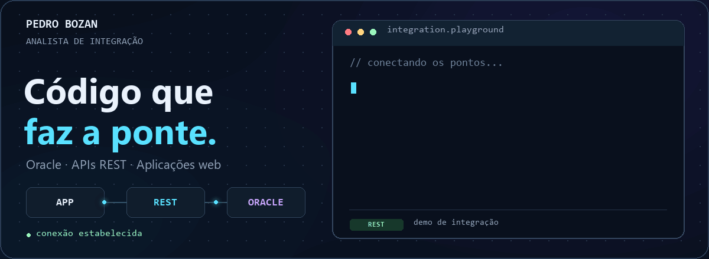

<picture>
  <source media="(prefers-reduced-motion: reduce)" srcset="banner-static.png">
  
</picture>

<h1 align="center">Olá, me chamo Pedro! 👋</h1>

  <b>Analista de Integração 😄</b>

  
  

## 👨‍💻 Entre um SELECT e um endpoint…

Sou **Analista de Integração Pleno** e atuo hoje na Unimed Blumenau, onde o meu dia a dia basicamente passa por **Oracle, SQL, PL/SQL e APIs REST**, fazendo a conexão entre sistemas e dados.

Quando uma ideia interna precisa ganhar vida e se tornar uma aplicação, então entram habilidades principalmente em **PHP, JavaScript, HTML e CSS** para a construção dos projetos, além da atuação em reuniões para entender as ideias dos solicitantes, levantar requisitos e fazer validações.

Agregar valor, impactar positivamente e trazer uma boa experiência entre usuário e sistema são algumas das prioridades.

## 🧰 Habilidades

**Para conectar os pontos entre sistemas:**

**Para dar vida as ideias:**

## 🚀 Principais Projetos

### 🏥 Totem · Unimed Blumenau

**Do toque na tela à integração com o Tasy.**

Aplicação de autoatendimento da Unimed Blumenau, sendo disponibilizado em várias unidades da cooperativa, como Pronto Atendimento, Hospital e Laboratórios, cada um com suas regras e particularidades. Nesse projeto atuei tanto no **desenvolvimento da aplicação web** quanto na **integração com Tasy/Oracle**.

<b>🔎 Abrir fluxo de autoatendimento</b>

O core da aplicação se baseia principalmente por:

1. O beneficiário se identifica com sua carteirinha ou CPF.
2. Atualiza seus dados cadastrais.
3. Seleciona o tipo de atendimento.
4. Registra um acompanhante.
5. Faz a assinatura do termo de atendimento.
6. Recebe a sua senha.

**Por trás da tela:** PHP · HTML · CSS · JavaScript · Oracle · Tasy

### 📍 [consulta-cep](https://github.com/PedroBozan/consulta-cep)

**Informar o CEP retorna os dados de endereço.**

Projeto em **PHP** que consulta dados de endereços usando a API pública do **ViaCEP**. Uma integração pequena, mas com uma utilidade bem direta.

### 📰 [clone-tabnews](https://github.com/PedroBozan/clone-tabnews)

**Construindo a aplicação e ao mesmo tempo aprendendo.**

Um projeto clone do TabNews e que está sendo desenvolvido principalmente em **JavaScript** durante o [curso.dev](https://curso.dev) do **Filipe Deschamps**.

## 📡 Sinais de vida no GitHub

[Ir aos repositórios →](https://github.com/PedroBozan?tab=repositories)
